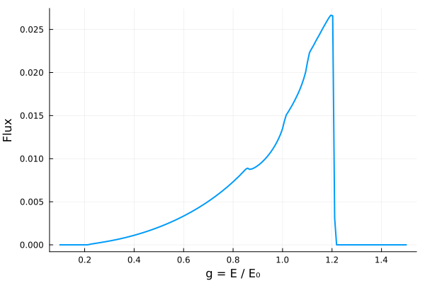

# Johannsen–Psaltis metric

The Johannsen–Psaltis metric is a Kerr-like parametric deviation designed to test the no-hair
theorem in the strong-field regime close to a black hole. It has three parameters: mass M, spin a, and deviation ϵ3.

## Metric definition

The Johannsen–Psaltis metric is given by

$$ds^2 = 
- \left(1 - \dfrac{r_s r}{\Sigma}\right)(1+h)\, dt^2

- \dfrac{2 r_s a r \sin^2\theta}{\Sigma} (1+h)\, dt\, d\phi + \dfrac{\Sigma (1+h)}{\Delta + a^2 h \sin^2\theta}\, dr^2

+ \Sigma\, d\theta^2 \\[3mm]

+ \left(r^2 + a^2 + \dfrac{r_s a^2 r \sin^2\theta}{\Sigma}


+ \dfrac{a^2 (\Sigma + r_s r) \sin^2\theta}{\Sigma} h \right) \sin^2\theta\, d\phi^2$$

or in matrix form:


$$g_{\mu\nu} =
\begin{pmatrix}
-(1+h)\left(1-\dfrac{r_s r}{\Sigma}\right) & 0 & 0 & -(1+h)\dfrac{a r_s r \sin^2\theta}{\Sigma} \\
0 & \dfrac{\Sigma(1+h)}{\Delta + a^2 h \sin^2\theta} & 0 & 0 \\
0 & 0 & \Sigma & 0 \\
-(1+h)\dfrac{a r_s r \sin^2\theta}{\Sigma} & 0 & 0 &
\sin^2\theta \left[r^2+a^2+\dfrac{a^2 r_s r \sin^2\theta}{\Sigma}
+h\dfrac{a^2(\Sigma+r_s r)\sin^2\theta}{\Sigma}\right]
\end{pmatrix}$$


where

$$\Sigma = r^{2} + a^{2} \cos^{2}\theta, \quad
\Delta = r^{2} - r_{s} r + a^{2}, \quad
r_{s} = 2 M, \quad
h = \epsilon_3 \dfrac{(r_s/2)^3 r}{\Sigma^2}$$


- ($t$) : time coordinate
- ($r$) : radial coordinate  
- ($\theta$) : polar angle  
- ($\phi$) : azimuthal angle  
- ($a$) : spin parameter $(0 \le a \le M)$
- ($\epsilon_{3}$) : deviation parameter


## Line Profile

```julia
using Gradus
using StaticArrays
using Plots

m = JohannsenPsaltisMetric(M = 1.0, a = 0.8, ϵ3 = 0.5) #defines the spacetime

d = ThinDisc(0.0, Inf) #defines the accretion disk. Gradus will start with the emission at the ISCO and extends to infinity

x = SVector(0.0, 10_000.0, deg2rad(60.0), 0.0)#defines the observers position in spacetime (t, r, θ, ϕ)

bins, flux = lineprofile(m, x, d)

fig4 = plot(
    bins,
    flux,
    xlabel = "g = E / E₀",
    ylabel = "Flux",
    legend = false,
    lw = 2
)
```



