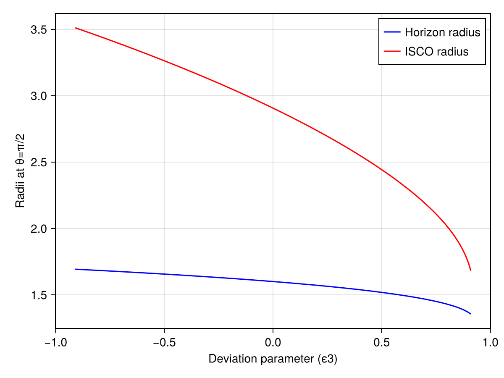
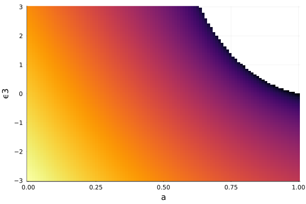
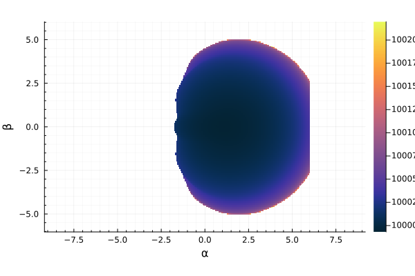
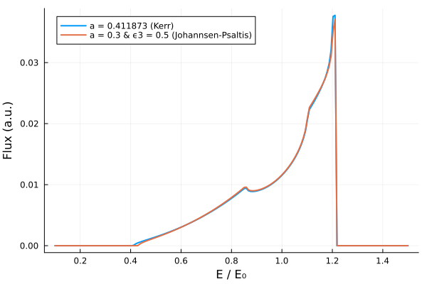
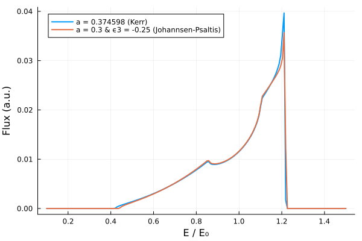

# Johannsen–Psaltis metric

The Johannsen–Psaltis metric is a Kerr-like parametric deviation designed to test the no-hair
theorem in the strong-field regime close to a black hole. It has three parameters: mass M, spin a, and deviation $\epsilon_{3}$.

## Metric definition

The Johannsen–Psaltis metric is given by

$$ds^2 = 
- \left(1 - \dfrac{r_s r}{\Sigma}\right)(1+h)\, dt^2

- \dfrac{2 r_s a r \sin^2\theta}{\Sigma} (1+h)\, dt\, d\phi + \dfrac{\Sigma (1+h)}{\Delta + a^2 h \sin^2\theta}\, dr^2

+ \Sigma\, d\theta^2 \\[3mm]

+ \left(r^2 + a^2 + \dfrac{r_s a^2 r \sin^2\theta}{\Sigma}


+ \dfrac{a^2 (\Sigma + r_s r) \sin^2\theta}{\Sigma} h \right) \sin^2\theta\, d\phi^2$$

or in matrix form:


$$g_{\mu\nu} =
\begin{pmatrix}
-(1+h)\left(1-\dfrac{r_s r}{\Sigma}\right) & 0 & 0 & -(1+h)\dfrac{a r_s r \sin^2\theta}{\Sigma} \\
0 & \dfrac{\Sigma(1+h)}{\Delta + a^2 h \sin^2\theta} & 0 & 0 \\
0 & 0 & \Sigma & 0 \\
-(1+h)\dfrac{a r_s r \sin^2\theta}{\Sigma} & 0 & 0 &
\sin^2\theta \left[r^2+a^2+\dfrac{a^2 r_s r \sin^2\theta}{\Sigma}
+h\dfrac{a^2(\Sigma+r_s r)\sin^2\theta}{\Sigma}\right]
\end{pmatrix}$$


where

$$\Sigma = r^{2} + a^{2} \cos^{2}\theta, \quad
\Delta = r^{2} - r_{s} r + a^{2}, \quad
r_{s} = 2 M, \quad
h = \epsilon_3 \dfrac{(r_s/2)^3 r}{\Sigma^2}$$

 
- ($a$) : spin parameter $(0 \le a \le M)$
- ($\epsilon_{3}$) : deviation parameter


## Parametric deviation Paramter

In the Johannsen–Psaltis metric, the deformation parameter ϵ3 is used to introduce deviations from the Kerr spacetime. The radii of the event horizon and the ISCO were plotted for different values of ϵ3.


```@raw html
<details>
<summary>Click to expand / collapse code block.</summary>
```

```julia
using Gradus
using Makie, CairoMakie


# Create a range of ϵ3 values from -1 to 1 with 200 steps
ϵ3_values = range(-0.91, 0.91, length=200)

# Initialize an array to store the horizon radii
horizon_radii = zeros(length(ϵ3_values))
# Initialize an array to store the ISCO radii
isco_radii = zeros(length(ϵ3_values))
# Initialize an array to store the photon orbit radii
#photon_radii = zeros(length(ϵ3_values))

# Calculate the horizon radius for each value of ϵ3
for (i, ϵ3) in enumerate(ϵ3_values)
    # m = KerrMetric(M = 1.0, a = a)
    m = JohannsenPsaltisMetric(M = 1.0, a = 0.8, ϵ3 = ϵ3)
    rs, θs = event_horizon(m, resolution = 200)
    
    # Find the index closest to the equatorial plane (θ = π/2)
    closest_idx = argmin(abs.(θs .- π/2))
    
    # Extract the radius at that index
    horizon_radii[i] = rs[closest_idx]

    # Calculate the ISCO radius
    println("Metric: ", m)
    isco_radii[i] = Gradus.isco(m)

     #Calculate the photon orbit radius
    #photon_radii[i] = 2*(1+cos((2/3)*acos(-a)))
end

# Plot the horizon radius as a function of ϵ3
fig = Figure()
ax = Axis(fig[1, 1], xlabel="Deviation parameter (ϵ3)", ylabel="Horizon radius at θ=π/2")
lines!(ax, ϵ3_values, horizon_radii, color=:blue, label="Horizon radius")
lines!(ax, ϵ3_values, isco_radii, color=:red, label="ISCO radius")
#lines!(ax, ϵ3_values, photon_radii, color=:green, label="Photon orbit radius")
axislegend(ax)  # Add a legend using the labels
fig

```
```@raw html
</details>
```



## Naked Singularities
Certain combinations of spin $(a)$ and the deviatoin parameter $(\epsilon_{3})$ can lead to the black hole having no event horizon at certain angles. This would lead to the singularity being exposed which is called a naked singularity.

The plot below shows the event horizon in the equatorial plane for different values of spin for $\epsilon_{3} = 2$. The parts of the event horizon that have no solution is where a naked singularity would be present.


```@raw html
<details>
<summary>Click to expand / collapse code block.</summary>
```

```julia
using Gradus, Plots

function draw_horizon(p, m)
    rs, θs = event_horizon(m, resolution = 200)
    radius = rs

    x = @. radius * sin(θs)
    y = @. radius * cos(θs)
    plot!(p, x, y, label = "a = $(m.a)")
end

p = plot(aspect_ratio = 1)
for a in [0.0, 0.5, 0.6, 0.7, 0.8, 0.9]
    m = JohannsenPsaltisMetric(M = 1.0, a = a, ϵ3 = 2.0)
    draw_horizon(p, m)
end
p
```
```@raw html
</details>
```


It can be seen from the plot below which combinations of $a$ and $\epsilon_3$ will produce a naked singularity.


```@raw html
<details>
<summary>Click to expand / collapse code block.</summary>
```
```julia

using Gradus
using Plots

function calc_exclusion(as, ϵs)
    regions = zeros(Float64, (length(as), length(ϵs)))
    Threads.@threads for i in eachindex(as)
        a = as[i]
        for (j, ϵ) in enumerate(ϵs)
            m = JohannsenPsaltisMetric(M = 1.0, a = a, ϵ3 = ϵ)
            regions[i, j] = if is_naked_singularity(m)
                NaN
            else
                Gradus.isco(m)
            end
        end
    end
    regions
end

as = range(0, 1.0, 100)
ϵs = range(-10, 10, 100)

img = calc_exclusion(as, ϵs)
heatmap(
    as,
    ϵs,
    img',
    colorbar = false,
    xlabel = "a",
    ylabel = "ϵ"
)
```
```@raw html
</details>
```




## Shawdow map

```@raw html
<details>
<summary>Click to expand / collapse code block.</summary>
```

```julia
sing Gradus, Plots

m = JohannsenPsaltisMetric(M = 1.0, a = 0.9, ϵ3 = 2.0 )
x = SVector(0.0, 10000.0, π / 2, 0.0)

α, β, img = rendergeodesics(
    m,
    x,
    20_000.0,
    image_width = 100,
    image_height = 100,
    αlims = (-6, 6),
    βlims = (-6, 6),
    verbose = true,
    ensemble = Gradus.EnsembleSerial(),   
)


p = Plots.heatmap(
    α,
    β,
    img,
    color = Plots.cgrad(:thermal, rev = false),
    xlabel = "α",
    ylabel = "β",
    aspect_ratio = 1,
    minorgrid = true,
)
```
```@raw html
</details>
```



## Degeneracy Testing 

Certain deformation parameter $\epsilon_{3}$ and spin a combinations for the Johannsen-Psaltis metric can produce indistinguishable spectral line profiles to the Kerr metric of a different spin.

```@raw html
<details>
<summary>Click to expand / collapse code block.</summary>
```

```julia

using Gradus
using StaticArrays
using Plots
using Interpolations, Statistics


a1 =  0.411873 
a2 = 0.3
ϵ3 = 0.5

m1 = KerrMetric(M = 1.0, a = a1) #defines the spacetime
m2 = JohannsenPsaltisMetric(M = 1.0, a = a2, ϵ3 = ϵ3 )
#is_naked_singularity(m2)

d = ThinDisc(0.0, Inf) #defines the accretion disk. Gradus will start with the emission at the ISCO and extends to infinity

x = SVector(0.0, 10_000.0, deg2rad(60), 0.0)#defines the observers position in spacetime (t, r, θ, ϕ)

bins1, flux1 = lineprofile(m1, x, d)

bins2, flux2  = lineprofile(m2, x, d)

#bins2, flux2  = lineprofile(m2, x, d; )#method = BinningMethod())

Plots.plot(
    bins1,
    flux1,
    xlabel = "E / E₀",
    ylabel = "Flux (a.u.)",
    legend = true,
    lw = 2,
    label = "a = $a1 (Kerr)"
)

Plots.plot!(
    bins2,
    flux2,
    xlabel = "E / E₀",
    ylabel = "Flux (a.u.)",
    legend = true,
    lw = 2,
    label = "a = $a2 & ϵ3 = $ϵ3 (Johannsen-Psaltis)"
)

```
```@raw html
</details>
```






