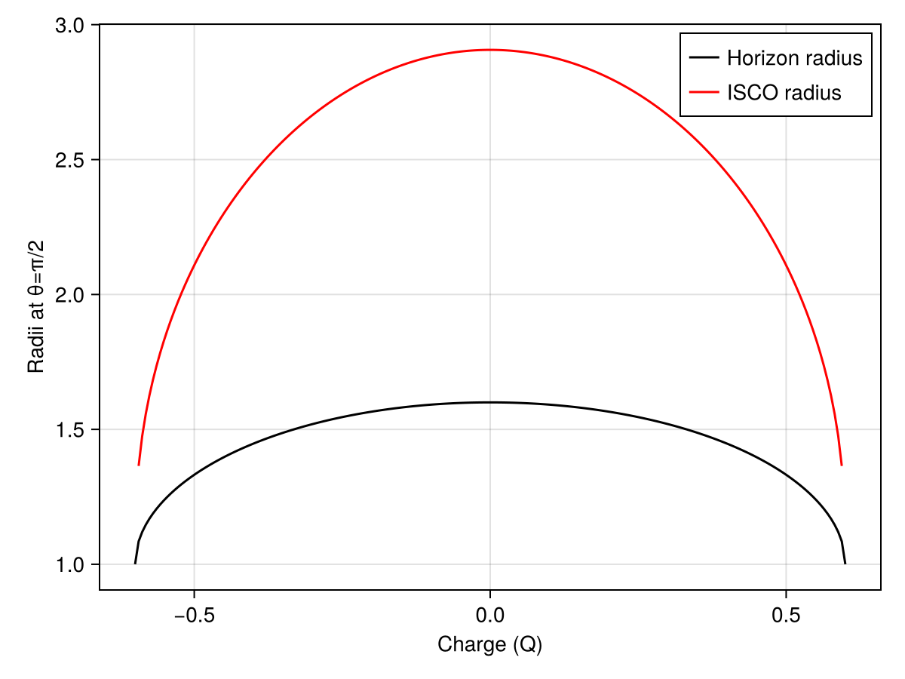

# Kerr - Newman metric

The Kerr-Newman metric describes the geometry of spacetime outside an electrically charged rotating black hole. It is fully parameterised by mass, spin and charge meaning it obeys the No-hair theorem.

## Metric definition

The Kerr-Newman metric is given by:

$$ds^2 = -\left(1 - \frac{r_{s}r- Q^{2}}{\Sigma}\right)dt^2 

- \frac{2a (r_{s}r - Q^2) \sin^{2}\theta}{\Sigma}dtd\phi 

+ \frac{\Sigma}{\Delta}dr^{2} + \Sigma d\theta^{2} 

+ \left(r^2 + a^2 + \frac{(r_{s}r - Q^2)a^{2}\sin^2\theta}{\Sigma}\right)\sin^2\theta d\phi^2$$


or in matrix form:


$$g_{\mu\nu} =
\begin{pmatrix}
-\left(1 - \dfrac{r_s r - Q^2}{\Sigma}\right) & 0 & 0 & -\dfrac{2a (r_{s}r - Q^2) \sin^{2}\theta}{\Sigma} \\

0 & \dfrac{\Sigma}{\Delta} & 0 & 0 \\

0 & 0 & \Sigma & 0 \\

-\dfrac{2a (r_{s}r - Q^2) \sin^{2}\theta}{\Sigma} & 0 & 0 & \left(r^2 + a^2 + \dfrac{(r_{s}r - Q^2)a^{2}\sin^2\theta}{\Sigma}\right) \sin^2\theta
\end{pmatrix}$$


where  

$$\Sigma = r^{2} + a^{2} \cos^{2}\theta, \quad
\Delta = r^{2} - r_{s} r + a^{2} + Q^{2}, \quad
r_{s} = 2 M$$
 
- ($a$) : spin parameter $(0 \le a \le M)$  
- ($Q$) : Electric charge

When $ (Q = 0)$, this reduces to the Kerr metric.

## Christoffel Symbols

$$\begin{aligned}
\Gamma^{r}{}_{tt} &= \frac{r_s\Delta (r^2 - a^2cos^2\theta)}{2 \Sigma^3}, & 
\Gamma^{\theta}{}_{tt} &= - \frac{r_sa^2rsin{\theta}cos\theta}{\Sigma^3}, \\[2mm]

\Gamma^{t}{}_{tr} &= \frac{r_s(r^2+a^2)(r^2-a^2cos^2\theta)}{2\Sigma^2\theta}, & 
\Gamma^{\phi}{}_{tr} &= \frac{ r_s a (r^2 - a^2 \cos^2\theta)}{2\Sigma^2 \Delta} , \\[2mm]

\Gamma^{t}{}_{t\theta} &= -\frac{r_s a^2 r \sin\theta \cos\theta}{\Sigma^2}, &
\Gamma^{\phi}{}_{t\theta} &= -\frac{r_s a r \cot\theta}{\Sigma^2} \\[2mm]

\Gamma^{r}{}_{t\phi} &= -\frac{\Delta r_s a \sin^2\theta(r^2 - a^2 \cos^2\theta)}{2\Sigma^3}, &
\Gamma^{\theta}{}_{t\phi} &= \frac{r_s a r (r^2 + a^2)\sin\theta\cos\theta}{\Sigma^3} , \\[2mm]

\Gamma^{r}{}_{rr} &= \frac{2 r a^2 \sin^2\theta - r_s (r^2 - a^2 \cos^2\theta)}{2\Sigma\Delta}, &
\Gamma^{\theta}{}_{rr} &= \frac{a^2 \sin\theta\cos\theta}{\Sigma\Delta}, \\[2mm]

\Gamma^{r}{}_{r\theta} &= -\frac{a^2 \sin\theta\cos\theta}{\Sigma} , &
\Gamma^{\theta}{}_{r\theta} &= \frac{r}{\Sigma} \\[2mm]

\Gamma^{r}{}_{\theta\theta} &= -\frac{r\Delta}{\Sigma}, &
\Gamma^{\theta}{}_{\theta\theta} &= -\frac{a^2 \sin\theta\cos\theta}{\Sigma},\\[2mm]

\Gamma^{\phi}{}_{\theta\phi} &= \frac{\cot\theta}{\Sigma^2}(\Sigma^2 + r_s a^2 r \sin^2\theta), &
\Gamma^{t}{}_{\theta\phi} &= \frac{r_s a^3 r \sin^3\theta\cos\theta}{\Sigma^2} , \\[2mm]

\Gamma^{t}{}_{r\phi} &= \frac{r_s a \sin^2\theta[a^2\cos^2\theta (a^2 - r^2) - r^2 (a^2 + 3r^2)]}{\,\Sigma^2\Delta}, &
\Gamma^{\phi}{}_{r\phi} &= \frac{2r\Sigma^2 + r_s[a^4\sin^2\theta\cos^2\theta - r^2(\Sigma + r^2 + a^2)]}{2\Sigma^2\Delta}, \\[2mm]

\Gamma^{r}{}_{\phi\phi} &= \frac{\Delta \sin^2\theta}{2\Sigma^3}[-2r\Sigma^2 + r_s a^2 \sin^2\theta(r^2 - a^2\cos^2\theta)], &
\Gamma^{\theta}{}_{\phi\phi} &= -\frac{\sin\theta\cos\theta}{\Sigma^3}[A\Sigma + (r^2 + a^2) r_s a^2 \sin^2\theta].

\end{aligned}$$

Where

$$A = (r^2 + a^2)\,\Sigma + r_s a^2 r \sin^2\theta$$

These symbols are the same as that for the Kerr metric as all that needs to change is the defenition of $\Delta$.

## Special radii

```@raw html
<details>
<summary>Click to expand / collapse code block.</summary>
```

```julia
using Gradus
using CairoMakie

M = 1.0
a = 0.8
qmax = 0.95 * sqrt(1 - a^2)
Q_values = range(-qmax, qmax, length=200)

horizon_radii = zeros(length(Q_values))
isco_radii = fill(NaN, length(Q_values))

for (i, q) in enumerate(Q_values)
    m = KerrNewmanMetric(M = M, a = a, Q = q)

    rs, θs = event_horizon(m, resolution = 200)
    closest_idx = argmin(abs.(θs .- π/2))
    horizon_radii[i] = rs[closest_idx]

    try
        isco_radii[i] = Gradus.isco(m)
    catch
        isco_radii[i] = NaN
    end
end

# Only after loop completes:

fig = Figure()
ax = Axis(fig[1, 1], xlabel="Charge Q", ylabel="Radius (equatorial plane)")

lines!(ax, Q_values, horizon_radii, color=:blue, label="Horizon radius")
lines!(ax, Q_values, isco_radii, color=:red, label="ISCO radius")

axislegend(ax)
display(fig)
```
```@raw html
</details>
```




