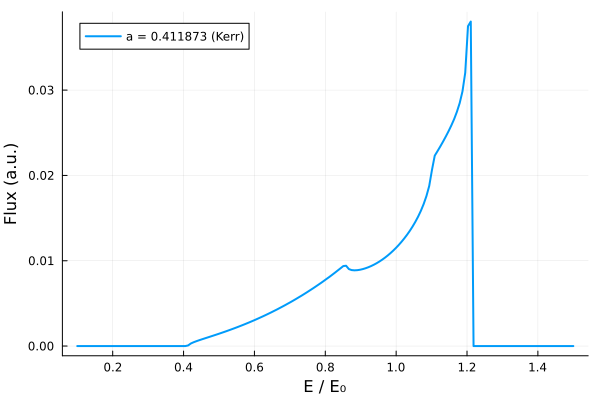

# Minkowski Metric

The Minkowski metric is the simplest spacetime metric, describing a flat spacetime with no curvature. It provides the geometric framework for special relativity.

## Metric Definition

The Minkowski metric in cartesian coordinates is given by:

$$ds^2 = -dt^2 + dx^2 + dy^2 + dz^2$$

or in matrix form:


$$g_{\mu\nu} =
\begin{pmatrix}
- 1 & 0 & 0 & 0 \\

0 & 1 & 0 & 0 \\

0 & 0 & 1 & 0 \\

0 & 0 & 0 & 1 \\
\end{pmatrix}$$


And in Boyer–Lindquist coordinates:

$$ds^2 = -dt^2 + dr^2 + r^2d\theta^2 + r^2sin^2{\theta}d\phi^2$$


$$g_{\mu\nu} =
\begin{pmatrix}
- 1 & 0 & 0 & 0 \\

0 & 1 & 0 & 0 \\

0 & 0 & r^2 & 0 \\

0 & 0 & 0 & r^2sin^2{\theta} \\
\end{pmatrix}$$


## Christoffel Symbols


$$\begin{aligned}
\Gamma^{r}_{\theta\theta} & = -r, &
\Gamma^{r}_{\phi\phi} & = -r\sin^2\theta, &
\Gamma^{\theta}_{r\theta} & = \frac{1}{r}, \\[2mm]
\Gamma^{\theta}_{\phi\phi} & = -\sin\theta\cos\theta, &
\Gamma^{\phi}_{r\phi} & = \frac{1}{r}, &
\Gamma^{\phi}_{\theta\phi} & = \cot\theta
\end{aligned}$$


## Riemann Tensors

As the Riemann tensor quantifies curvature, all of its components are identically equal to zero in Minkowski (flat) spacetime.

## World Lines

Geodesics in flat space correspond to straight line motion, and no characteristic radii such as the event
horizon, ISCO, or photon sphere exist. This behaviour is illustrated in the Figure below, where particle trajectories follow straight world lines and light rays propagate along $x=\pm t$.

The trajectories plotted are all time-like $(ds^2<0)$ and therefore lie within the light cone defined by the dashed lines corresponding to null (light-like) rays.


```@raw html
<details>
<summary>Click to expand / collapse code block.</summary>
```

```julia

using CairoMakie

# Time range
t = range(0, 10, length=200)

# Different velocities where |v| < 1
velocities = [-0.8, -0.4, 0.0, 0.4, 0.8]

fig = Figure()
ax = Axis(fig[1, 1],
    xlabel = "x",
    ylabel = "t",
)

for v in velocities
    x = v .* t  # straight line
    lines!(ax, x, t, label = "v = $(v)")
end

# Plot light rays (x = ±t)
lines!(ax, t, t, linestyle = :dash, color = :black, label = "light ray")
lines!(ax, -t, t, linestyle = :dash, color = :black)

axislegend(ax, position = :rb)

fig


```
```@raw html
</details>
```




