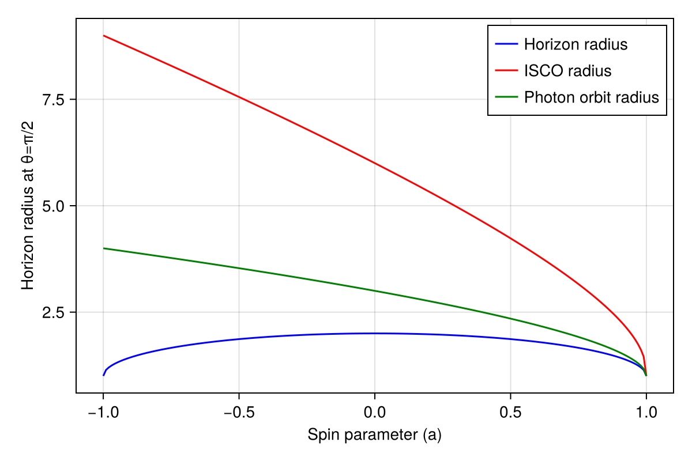
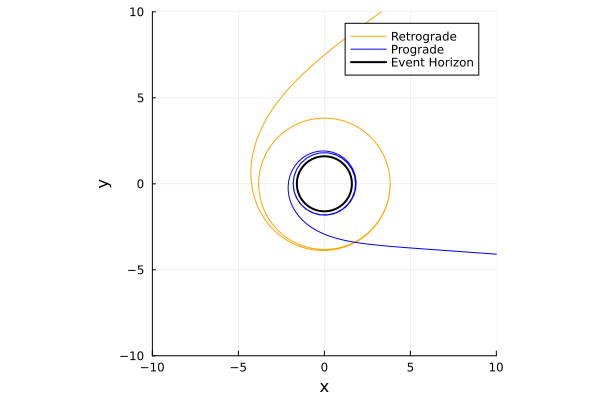

# Kerr metric

The Kerr metric describes the geometry of spacetime outside a rotating black hole with no magnetic field.

## Metric definition

The Kerr metric is given by:


$$ds^2 = -\left(1 - \frac{r_{s}r}{\Sigma}\right)dt^2 - \frac{2 r_{s}ra \sin^{2}\theta}{\Sigma}dtd\phi + \frac{\Sigma}{\Delta}dr^{2} + \Sigma d\theta^{2} + \left(r^2 + a^2 + \frac{r_{s}ra^{2} \sin^2\theta}{\Sigma}\right)\sin^2\theta d\phi^2$$

where  

$$\Sigma = r^{2} + a^{2} \cos^{2}\theta, \quad
\Delta = r^{2} - r_{s} r + a^{2}, \quad
r_{s} = 2 M$$

- ($t$) : time coordinate  
- ($r$) : radial coordinate  
- ($\theta$) : polar angle  
- ($\phi$) : azimuthal angle  
- ($a$) : spin parameter $(0 \le a \le 1)$  

When $(a = 0)$, this reduces to the Schwarzschild metric.


## Special radii

The act of rotating introduces the phenomena known as frame dragging. Frame dragging is where spacetime itself is dragged inthe direction of the bodies rotation. This means that key radii around a spinning black hole will vary depending on the angular momentum.

```julia Kerr_Radii_Plot

using Gradus
using Makie, CairoMakie

# Plot of horizon radius as a function of spin parameter a #

# Create a range of a values from -1 to 1 with 100 steps
a_values = range(-1, 1, length=200)

# Initialize an array to store the horizon radii
horizon_radii = zeros(length(a_values))
# Initialize an array to store the ISCO radii
isco_radii = zeros(length(a_values))
# Initialize an array to store the photon orbit radii
photon_radii = zeros(length(a_values))

# Calculate the horizon radius for each value of a
for (i, a) in enumerate(a_values)
    m = KerrMetric(M = 1.0, a = a)
    rs, θs = event_horizon(m, resolution = 200)
    
    # Find the index closest to the equatorial plane (θ = π/2)
    closest_idx = argmin(abs.(θs .- π/2))
    
    # Extract the radius at that index
    horizon_radii[i] = rs[closest_idx]

    # Calculate the ISCO radius
    isco_radii[i] = Gradus.isco(m)

     #Calculate the photon orbit radius
    photon_radii[i] = 2*(1+cos((2/3)*acos(-a)))
end

# Plot the horizon radius as a function of a
fig = Figure()
ax = Axis(fig[1, 1], xlabel="Spin parameter (a)", ylabel="Horizon radius at θ=π/2")
lines!(ax, a_values, horizon_radii, color=:blue, label="Horizon radius")
lines!(ax, a_values, isco_radii, color=:red, label="ISCO radius")
lines!(ax, a_values, photon_radii, color=:green, label="Photon orbit radius")
axislegend(ax)  # Add a legend using the labels

fig
```



A spinning black hole can have two possible photon orbits and ISCOs. One in the direction of the spinning black hole (prograde) and one against it (retrograde).

In the case of the photon orbit:

```julia Photon_Orbits
using Gradus, Plots

m = KerrMetric(M=1.5, a=1.0)
# observer position
x = SVector(0.0, 10000.0, π/2, 0.0)

# set up impact parameter space
α = collect(range(-5.4808, 9.6466, 2))
β = fill(0, size(α))

# build initial velocity and position vectors
vs = map_impact_parameters(m, x, α, β)
xs = fill(x, size(vs))

sols = tracegeodesics(m, xs, vs, 20000.0)

fig2 = plot_paths(sols, legend = true, n_points = 2048, label = "Photon Trajectory")
plot_horizon!(m, lw = 2.0, color = :black, label = "Event Horizon")
```


In this case the blue line depicts the prograde orbit and the orange line depicts the retrograde orbit.

