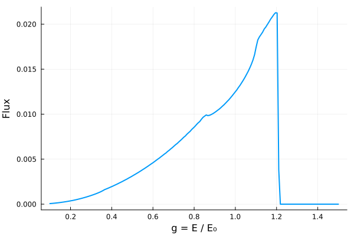

# Kerr metric

The Kerr metric describes the geometry of spacetime outside a rotating black hole with no magnetic field. It has two parameters: mass M and spin a.

## Metric definition

The Kerr metric is given by:


$$ds^2 = -\left(1 - \frac{r_{s}r}{\Sigma}\right)dt^2 - \frac{2 r_{s}ar \sin^{2}\theta}{\Sigma}dtd\phi + \frac{\Sigma}{\Delta}dr^{2} + \Sigma d\theta^{2} + \left(r^2 + a^2 + \frac{r_{s}a^{2}r \sin^2\theta}{\Sigma}\right)\sin^2\theta d\phi^2$$

or in matrix form:


$$g_{\mu\nu} =
\begin{pmatrix}
-\left(1 - \dfrac{r_s r}{\Sigma}\right) & 0 & 0 & -\dfrac{r_s a r \sin^2\theta}{\Sigma} \\
0 & \dfrac{\Sigma}{\Delta} & 0 & 0 \\
0 & 0 & \Sigma & 0 \\
-\dfrac{r_s a r \sin^2\theta}{\Sigma} & 0 & 0 & \left(r^2 + a^2 + \dfrac{r_s a^2 r \sin^2\theta}{\Sigma}\right) \sin^2\theta
\end{pmatrix}$$


where  

$$\Sigma = r^{2} + a^{2} \cos^{2}\theta, \quad
\Delta = r^{2} - r_{s} r + a^{2}, \quad
r_{s} = 2 M$$

- ($t$) : time coordinate
- ($r$) : radial coordinate  
- ($\theta$) : polar angle  
- ($\phi$) : azimuthal angle  
- ($a$) : spin parameter $(0 \le a \le M)$  

When $(a = 0)$, this reduces to the Schwarzschild metric.


## Christoffel symbols


$$\begin{aligned}
\Gamma^{r}{}_{tt} &= \frac{r_s\Delta (r^2 - a^2cos^2\theta)}{2 \Sigma^3}, & 
\Gamma^{\theta}{}_{tt} &= - \frac{r_sa^2rsin{\theta}cos\theta}{\Sigma^3}, \\[2mm]

\Gamma^{t}{}_{tr} &= \frac{r_s(r^2+a^2)(r^2-a^2cos^2\theta)}{2\Sigma^2\theta}, & 
\Gamma^{\phi}{}_{tr} &= \frac{ r_s a (r^2 - a^2 \cos^2\theta)}{2\Sigma^2 \Delta} , \\[2mm]

\Gamma^{t}{}_{t\theta} &= -\frac{r_s a^2 r \sin\theta \cos\theta}{\Sigma^2}, &
\Gamma^{\phi}{}_{t\theta} &= -\frac{r_s a r \cot\theta}{\Sigma^2} \\[2mm]

\Gamma^{r}{}_{t\phi} &= -\frac{\Delta r_s a \sin^2\theta(r^2 - a^2 \cos^2\theta)}{2\Sigma^3}, &
\Gamma^{\theta}{}_{t\phi} &= \frac{r_s a r (r^2 + a^2)\sin\theta\cos\theta}{\Sigma^3} , \\[2mm]

\Gamma^{r}{}_{rr} &= \frac{2 r a^2 \sin^2\theta - r_s (r^2 - a^2 \cos^2\theta)}{2\Sigma\Delta}, &
\Gamma^{\theta}{}_{rr} &= \frac{a^2 \sin\theta\cos\theta}{\Sigma\Delta}, \\[2mm]

\Gamma^{r}{}_{r\theta} &= -\frac{a^2 \sin\theta\cos\theta}{\Sigma} , &
\Gamma^{\theta}{}_{r\theta} &= \frac{r}{\Sigma} \\[2mm]

\Gamma^{r}{}_{\theta\theta} &= -\frac{r\Delta}{\Sigma}, &
\Gamma^{\theta}{}_{\theta\theta} &= -\frac{a^2 \sin\theta\cos\theta}{\Sigma},\\[2mm]

\Gamma^{\phi}{}_{\theta\phi} &= \frac{\cot\theta}{\Sigma^2}(\Sigma^2 + r_s a^2 r \sin^2\theta), &
\Gamma^{t}{}_{\theta\phi} &= \frac{r_s a^3 r \sin^3\theta\cos\theta}{\Sigma^2} , \\[2mm]

\Gamma^{t}{}_{r\phi} &= \frac{r_s a \sin^2\theta[a^2\cos^2\theta (a^2 - r^2) - r^2 (a^2 + 3r^2)]}{\,\Sigma^2\Delta}, &
\Gamma^{\phi}{}_{r\phi} &= \frac{2r\Sigma^2 + r_s[a^4\sin^2\theta\cos^2\theta - r^2(\Sigma + r^2 + a^2)]}{2\Sigma^2\Delta}, \\[2mm]

\Gamma^{r}{}_{\phi\phi} &= \frac{\Delta \sin^2\theta}{2\Sigma^3}[-2r\Sigma^2 + r_s a^2 \sin^2\theta(r^2 - a^2\cos^2\theta)], &
\Gamma^{\theta}{}_{\phi\phi} &= -\frac{\sin\theta\cos\theta}{\Sigma^3}[A\Sigma + (r^2 + a^2) r_s a^2 \sin^2\theta].

\end{aligned}$$

Where

$$A = (r^2 + a^2)\,\Sigma + r_s a^2 r \sin^2\theta$$


## Special radii

### Frame Dragging

In the case of a spinning black hole, rotation leads to the dragging of spacetime
in the direction of the spin, an effect known as frame dragging. Frame dragging causes orbits like the ISCO and photon orbit to vary in radius. The effect that frame dragging has on the photon orbit and
the ISCO will increase with the angular momentum of the black hole.


```@raw html
<details>
<summary>Click to expand / collapse code block.</summary>
```

```julia Kerr_Radii_Plot

using Gradus
using Makie, CairoMakie


# Create a range of a values from -1 to 1 with 200 steps
a_values = range(-1.0, 1.0, length=200)

# Initialize an array to store the horizon radii
horizon_radii = zeros(length(a_values))
# Initialize an array to store the ISCO radii
isco_radii = zeros(length(a_values))
# Initialize an array to store the photon orbit radii
photon_radii = zeros(length(a_values))

# Calculate the horizon radius for each value of a
for (i, a) in enumerate(a_values)
    m = KerrMetric(M = 1.0, a = a)
    rs, θs = event_horizon(m, resolution = 200)
    
    # Find the index closest to the equatorial plane (θ = π/2)
    closest_idx = argmin(abs.(θs .- π/2))
    
    # Extract the radius at that index
    horizon_radii[i] = rs[closest_idx]

    # Calculate the ISCO radius
    println("Metric: ", m)
    isco_radii[i] = Gradus.isco(m)

     #Calculate the photon orbit radius for a Kerr black hole
    photon_radii[i] = 2*(1+cos((2/3)*acos(-a)))
end

# Plot the radii as a function of a
fig = Figure()
ax = Axis(fig[1, 1], xlabel="Spin parameter (a)", ylabel="Radii at θ=π/2")
lines!(ax, a_values, horizon_radii, color=:black, label="Horizon radius")
lines!(ax, a_values, isco_radii, color=:red, label="ISCO radius")
lines!(ax, a_values, photon_radii, color=:blue, label="Photon orbit radius")
axislegend(ax)  # Add a legend using the labels
fig
```
```@raw html
</details>
```


### Prograde and Retrograde Orbits


A spinning black hole can have two possible photon orbits and ISCOs. One in the direction of the spinning black hole (prograde) and one against it (retrograde). 

A clear visual representation of frame dragging is provided by the figure below. It depicts  two photons orbit a Kerr black hole. One orbits in the same direction as the black hole’s rotation (prograde)and one orbits in the opposite direction (retrograde).

Frame dragging effectively boosts prograde motion, allowing the prograde orbit to lie closer to the event horizon, while the retrograde orbit occurs at a larger radius as it opposes the
frame dragging.

```@raw html
<details>
<summary>Click to expand / collapse code block.</summary>
```

```julia Photon_Orbits
using Gradus, Plots

#Prograde and retrograde photon orbits


# Kerr black hole
m = KerrMetric(M=1.0, a=0.8)
λ_max = 2000

# Radii
r_pro   = 1.81109
r_retro = 3.81877   #radii that give circular orbits

# Circular geodesic velocities
v_pro = CircularOrbits.fourvelocity(m, r_pro; contra_rotating=false)
v_retro = CircularOrbits.fourvelocity(m, r_retro; contra_rotating=true)

# Initial positions
x_pro    = @SVector [0.0, r_pro, π/2, 0.0]
x_retro = @SVector [0.0, r_retro, π/2, 0.0]

# Trace geodesics
sol_pro = tracegeodesics(m, x_pro, v_pro, λ_max, μ=0.0)   #μ=0.0 is null geodesic (photon)
sol_retro = tracegeodesics(m, x_retro, v_retro, λ_max, μ=0.0)
# Plotting
p = plot(aspect_ratio=1)

plot_paths!(p, sol_retro, label="Retrograde", color=:orange, n_points = 100000)
plot_paths!(p, sol_pro, label="Prograde", color=:blue, n_points = 100000)
plot_horizon!(m, lw=2, color=:black, label="Event Horizon")

xlims!(-10, 10)
ylims!(-10, 10)


xlabel!("x")
ylabel!("y")
```
```@raw html
</details>
```


## Line Profiles 

```@raw html
<details>
<summary>Click to expand / collapse code block.</summary>
```

```julia
using Gradus
using StaticArrays
using Plots

m = KerrMetric(M = 1.0, a = 0.998) #defines the spacetime

d = ThinDisc(0.0, Inf) #defines the accretion disk. Gradus will start with the emission at the ISCO and extends to infinity

x = SVector(0.0, 10_000.0, deg2rad(60.0), 0.0)#defines the observers position in spacetime (t, r, θ, ϕ)

bins, flux = lineprofile(m, x, d)

fig4 = plot(
    bins,
    flux,
    xlabel = "g = E / E₀",
    ylabel = "Flux",
    legend = false,
    lw = 2
)
```
```@raw html
</details>
```




