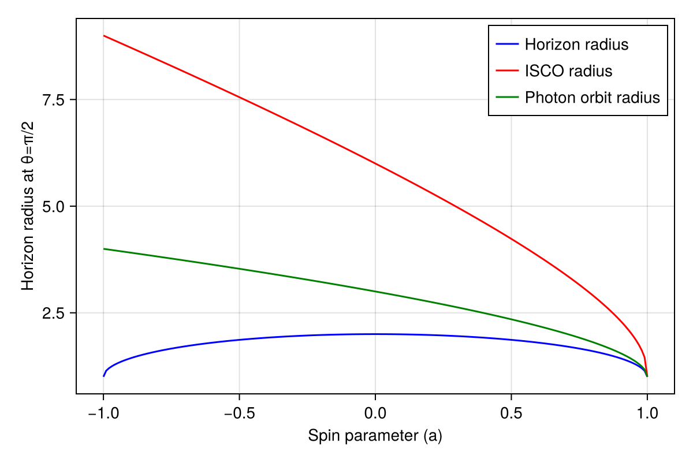
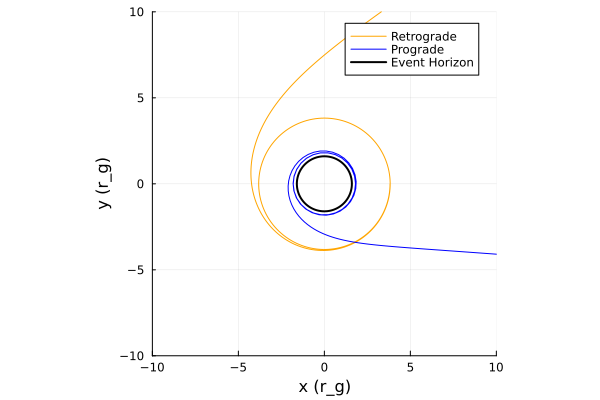
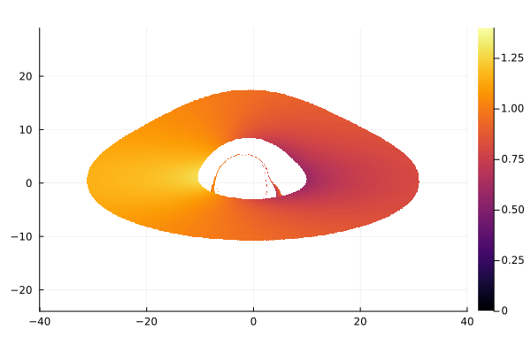
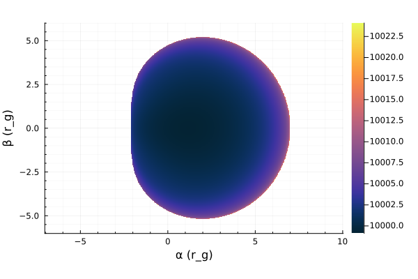
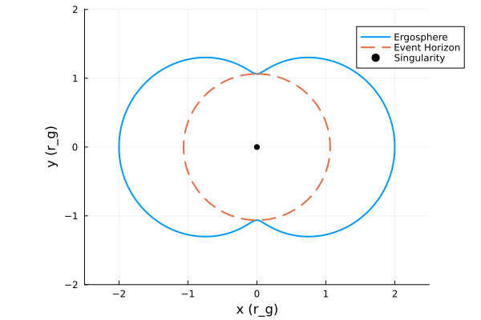
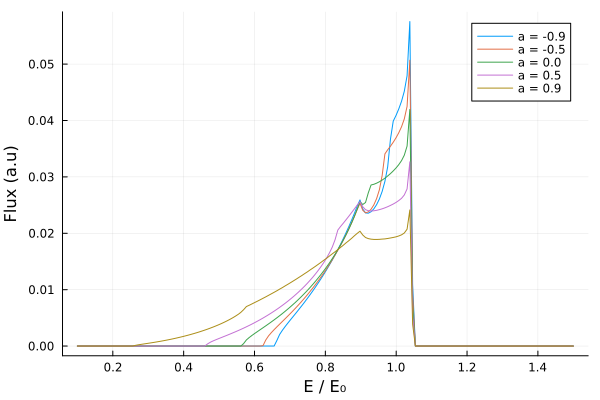
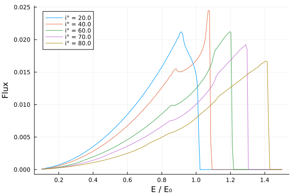

# Kerr metric

The Kerr metric describes the geometry of spacetime outside a rotating black hole with no magnetic field. It is fully defined by mass and spin meaning it obeys the No-hair theorem and is an exact solution to Einstein's field equations.

## Metric definition

The Kerr metric is given by:


$$ds^2 = -\left(1 - \frac{r_{s}r}{\Sigma}\right)dt^2 - \frac{2 r_{s}ar \sin^{2}\theta}{\Sigma}dtd\phi + \frac{\Sigma}{\Delta}dr^{2} + \Sigma d\theta^{2} + \left(r^2 + a^2 + \frac{r_{s}a^{2}r \sin^2\theta}{\Sigma}\right)\sin^2\theta d\phi^2$$

or in matrix form:


$$g_{\mu\nu} =
\begin{pmatrix}
-\left(1 - \dfrac{r_s r}{\Sigma}\right) & 0 & 0 & -\dfrac{r_s a r \sin^2\theta}{\Sigma} \\
0 & \dfrac{\Sigma}{\Delta} & 0 & 0 \\
0 & 0 & \Sigma & 0 \\
-\dfrac{r_s a r \sin^2\theta}{\Sigma} & 0 & 0 & \left(r^2 + a^2 + \dfrac{r_s a^2 r \sin^2\theta}{\Sigma}\right) \sin^2\theta
\end{pmatrix}$$


where  

$$\Sigma = r^{2} + a^{2} \cos^{2}\theta, \quad
\Delta = r^{2} - r_{s} r + a^{2}, \quad
r_{s} = 2 M$$
 
- ($a$) : spin parameter $(0 \le a \le M)$  

When $(a = 0)$, this reduces to the Schwarzschild metric.


## Christoffel symbols


$$\begin{aligned}
\Gamma^{r}{}_{tt} &= \frac{r_s\Delta (r^2 - a^2cos^2\theta)}{2 \Sigma^3}, & 
\Gamma^{\theta}{}_{tt} &= - \frac{r_sa^2rsin{\theta}cos\theta}{\Sigma^3}, \\[2mm]

\Gamma^{t}{}_{tr} &= \frac{r_s(r^2+a^2)(r^2-a^2cos^2\theta)}{2\Sigma^2\theta}, & 
\Gamma^{\phi}{}_{tr} &= \frac{ r_s a (r^2 - a^2 \cos^2\theta)}{2\Sigma^2 \Delta} , \\[2mm]

\Gamma^{t}{}_{t\theta} &= -\frac{r_s a^2 r \sin\theta \cos\theta}{\Sigma^2}, &
\Gamma^{\phi}{}_{t\theta} &= -\frac{r_s a r \cot\theta}{\Sigma^2} \\[2mm]

\Gamma^{r}{}_{t\phi} &= -\frac{\Delta r_s a \sin^2\theta(r^2 - a^2 \cos^2\theta)}{2\Sigma^3}, &
\Gamma^{\theta}{}_{t\phi} &= \frac{r_s a r (r^2 + a^2)\sin\theta\cos\theta}{\Sigma^3} , \\[2mm]

\Gamma^{r}{}_{rr} &= \frac{2 r a^2 \sin^2\theta - r_s (r^2 - a^2 \cos^2\theta)}{2\Sigma\Delta}, &
\Gamma^{\theta}{}_{rr} &= \frac{a^2 \sin\theta\cos\theta}{\Sigma\Delta}, \\[2mm]

\Gamma^{r}{}_{r\theta} &= -\frac{a^2 \sin\theta\cos\theta}{\Sigma} , &
\Gamma^{\theta}{}_{r\theta} &= \frac{r}{\Sigma} \\[2mm]

\Gamma^{r}{}_{\theta\theta} &= -\frac{r\Delta}{\Sigma}, &
\Gamma^{\theta}{}_{\theta\theta} &= -\frac{a^2 \sin\theta\cos\theta}{\Sigma},\\[2mm]

\Gamma^{\phi}{}_{\theta\phi} &= \frac{\cot\theta}{\Sigma^2}(\Sigma^2 + r_s a^2 r \sin^2\theta), &
\Gamma^{t}{}_{\theta\phi} &= \frac{r_s a^3 r \sin^3\theta\cos\theta}{\Sigma^2} , \\[2mm]

\Gamma^{t}{}_{r\phi} &= \frac{r_s a \sin^2\theta[a^2\cos^2\theta (a^2 - r^2) - r^2 (a^2 + 3r^2)]}{\,\Sigma^2\Delta}, &
\Gamma^{\phi}{}_{r\phi} &= \frac{2r\Sigma^2 + r_s[a^4\sin^2\theta\cos^2\theta - r^2(\Sigma + r^2 + a^2)]}{2\Sigma^2\Delta}, \\[2mm]

\Gamma^{r}{}_{\phi\phi} &= \frac{\Delta \sin^2\theta}{2\Sigma^3}[-2r\Sigma^2 + r_s a^2 \sin^2\theta(r^2 - a^2\cos^2\theta)], &
\Gamma^{\theta}{}_{\phi\phi} &= -\frac{\sin\theta\cos\theta}{\Sigma^3}[A\Sigma + (r^2 + a^2) r_s a^2 \sin^2\theta].

\end{aligned}$$

Where

$$A = (r^2 + a^2)\,\Sigma + r_s a^2 r \sin^2\theta$$


## Special radii

### Frame Dragging

In the case of a spinning black hole, rotation leads to the dragging of spacetime
in the direction of the spin, an effect known as frame dragging. Frame dragging causes orbits like the ISCO and photon orbit to vary in radius. The effect that frame dragging has on the photon orbit and
the ISCO will increase with the angular momentum of the black hole.


```@raw html
<details>
<summary>Click to expand / collapse code block.</summary>
```

```julia Kerr_Radii_Plot

using Gradus
using Makie, CairoMakie


# Create a range of a values from -1 to 1 with 200 steps
a_values = range(-1.0, 1.0, length=200)

# Initialize an array to store the horizon radii
horizon_radii = zeros(length(a_values))
# Initialize an array to store the ISCO radii
isco_radii = zeros(length(a_values))
# Initialize an array to store the photon orbit radii
photon_radii = zeros(length(a_values))

# Calculate the horizon radius for each value of a
for (i, a) in enumerate(a_values)
    m = KerrMetric(M = 1.0, a = a)
    rs, θs = event_horizon(m, resolution = 200)
    
    # Find the index closest to the equatorial plane (θ = π/2)
    closest_idx = argmin(abs.(θs .- π/2))
    
    # Extract the radius at that index
    horizon_radii[i] = rs[closest_idx]

    # Calculate the ISCO radius
    println("Metric: ", m)
    isco_radii[i] = Gradus.isco(m)

     #Calculate the photon orbit radius for a Kerr black hole
    photon_radii[i] = 2*(1+cos((2/3)*acos(-a)))
end

# Plot the radii as a function of a
fig = Figure()
ax = Axis(fig[1, 1], xlabel="Spin parameter (a)", ylabel="Radii at θ=π/2")
lines!(ax, a_values, horizon_radii, color=:black, label="Horizon radius")
lines!(ax, a_values, isco_radii, color=:red, label="ISCO radius")
lines!(ax, a_values, photon_radii, color=:blue, label="Photon orbit radius")
axislegend(ax)  # Add a legend using the labels
fig
```
```@raw html
</details>
```




### Prograde and Retrograde Orbits


A spinning black hole can have two possible photon orbits and ISCOs. One in the direction of the spinning black hole (prograde) and one against it (retrograde). 

A clear visual representation of frame dragging is provided by the figure below. It depicts  two photons orbit a Kerr black hole. One orbits in the same direction as the black hole’s rotation (prograde)and one orbits in the opposite direction (retrograde).

Frame dragging effectively boosts prograde motion, allowing the prograde orbit to lie closer to the event horizon, while the retrograde orbit occurs at a larger radius as it opposes the
frame dragging.

```@raw html
<details>
<summary>Click to expand / collapse code block.</summary>
```

```julia Photon_Orbits
using Gradus, Plots

#Prograde and retrograde photon orbits


# Kerr black hole
m = KerrMetric(M=1.0, a=0.8)
λ_max = 2000

# Radii
r_pro   = 1.81109
r_retro = 3.81877   #radii that give circular orbits

# Circular geodesic velocities
v_pro = CircularOrbits.fourvelocity(m, r_pro; contra_rotating=false)
v_retro = CircularOrbits.fourvelocity(m, r_retro; contra_rotating=true)

# Initial positions
x_pro    = @SVector [0.0, r_pro, π/2, 0.0]
x_retro = @SVector [0.0, r_retro, π/2, 0.0]

# Trace geodesics
sol_pro = tracegeodesics(m, x_pro, v_pro, λ_max, μ=0.0)   #μ=0.0 is null geodesic (photon)
sol_retro = tracegeodesics(m, x_retro, v_retro, λ_max, μ=0.0)
# Plotting
p = plot(aspect_ratio=1)

plot_paths!(p, sol_retro, label="Retrograde", color=:orange, n_points = 100000)
plot_paths!(p, sol_pro, label="Prograde", color=:blue, n_points = 100000)
plot_horizon!(m, lw=2, color=:black, label="Event Horizon")

xlims!(-10, 10)
ylims!(-10, 10)


xlabel!("x")
ylabel!("y")
```
```@raw html
</details>
```




## Redshift Heatmap

The following animation shows how radiation from the accretion disc is shifted in wavelength. The animation starts with a negative (clockwise) spin $(a=-1)$ of the central black hole and slowly increases to $a=1$.

The empty region in the centre corresponds to the ISCO. As the black hole spin increases, the ISCO moves inward, causing this central hole to shrink.

The accretion disc itself spins anticlockwise throughout, which is why the blueshifted (bright) side of the disc is always on the left and the redshifted (dark) side is on the right. As the spin increases, the Doppler shift becomes stronger, making the bright and dark regions more intense.

```@raw html
<details>
<summary>Click to expand / collapse code block.</summary>
```

```julia

using Gradus, Plots

n = 10
a_vals = range(-0.998, 0.998, length=n)

anim = @animate for a ∈ a_vals

    # metric and metric parameters
    m = KerrMetric(M=1.0, a=a)
    # observer position
    x = SVector(0.0, 1000.0, deg2rad(70), 0.0)
    # accretion disc
    d = ThinDisc(Gradus.isco(m), 30.0)

    pf = ConstPointFunctions.redshift(m, x) ∘ ConstPointFunctions.filter_intersected()

    α, β, img = rendergeodesics(
        m,
        x,
        d,
        # maximum integration time
        2000.0,
        αlims = (-40, 40),
        βlims = (-20, 25),
        image_width = 800,
        image_height = 400,
        verbose = true,
        pf = pf,
    )
    
    heatmap(α, β, img, aspect_ratio = 1, clims = (0, 1.4))
end
gif(anim, "disc_image.gif", fps = 10)
```
```@raw html
</details>
```




## Shawdow map

A black hole shadow map shows which photons from a background source behind the black hole reach a distant observer and which are captured by the black hole. The spacetime around a Kerr black hole is axially symmetric, and due to frame dragging, photons moving in the same direction as the spin (prograde) and those moving against it (retrograde) are affected differently. This is why the shadow in the plot below has a D shape.


```@raw html
<details>
<summary>Click to expand / collapse code block.</summary>
```

```julia
using Gradus, Plots

m = KerrMetric(1.0, 0.998)
x = SVector(0.0, 10000.0, π / 2, 0.0)

α, β, img = rendergeodesics(
    m,
    x,
    20_000.0,
    image_width = 100,
    image_height = 100,
    αlims = (-6, 9),
    βlims = (-6, 6),
    verbose = true,
    ensemble = Gradus.EnsembleSerial(),  
)

p = Plots.heatmap(
    α,
    β,
    img,
    color = Plots.cgrad(:thermal, rev = true),
    xlabel = "α",
    ylabel = "β",
    aspect_ratio = 1,
    minorgrid = true,
)

```
```@raw html
</details>
```





## Ergosphere

Around rotating black holes there exists a region known as the ergosphere defined by the condition:

$$g_{tt} = 0$$

Solving this for the Kerr spacetime gives a quadratic in $r$ which leads to the solution:

$$r_{\text{ergo}} = M + \sqrt{M^2 - a^2 \cos^2\theta}$$

Inside this region, all time-like trajectories are forced to co-rotate with the black hole, meaning
that stationary observers with fixed $\phi$ do not exist. Outside the ergosphere, static observers with
$\dfrac{d\phi}{dt} = 0$ are permitted, whereas within it, such trajectories are no longer physically possible.

The following figure shows the ergosphere for a maximally spinning Kerr black hole.

```@raw html
<details>
<summary>Click to expand / collapse code block.</summary>
```

```julia
using Gradus, Plots

M = 1.0
m = KerrMetric(M=M, a=1.0)

p = Plots.plot(
    aspect_ratio=1,
    legend=:topright,
    xlabel="x (r_g)",
    ylabel="y (r_g)"
)

θ = range(0, 2π, length=1000)

# Ergosphere radius
r_erg = M .+ sqrt.(M^2 .- m.a^2 .* cos.(θ).^2)

# Convert to Cartesian coordinates
x_erg = r_erg .* sin.(θ)
y_erg = r_erg .* cos.(θ)

# Plot Ergosphere
Plots.plot!(p, x_erg, y_erg,
    label="Ergosphere",
    lw=2,
    linestyle=:dash,
    color=:red
)

Plots.xlims!(-3, 3)
Plots.ylims!(-2, 2)

# Event horizon
plot_horizon!(m, lw=2, color=:black, label="Event Horizon")
```
```@raw html
</details>
```




As this is a maximally spinning black hole, the ergosphere expands significantly near the equatorial plane while remaining constrained near the poles. As the spin of the black hole decreases, the ergosphere becomes more spherically symmetric and closer to the event horizon.


## Line Profiles 

```@raw html
<details>
<summary>Click to expand / collapse code block.</summary>
```

```julia
using Gradus
using StaticArrays
using Plots

spins = [-0.9, -0.5, 0.0, 0.5, 0.9]
d = ThinDisc(0.0, Inf)
x = SVector(0.0, 10_000.0, deg2rad(30.0), 0.0)

plt = Plots.plot(
    xlabel = "E / E₀",
    ylabel = "Flux",
    lw = 2
)

for a in spins
    m = KerrMetric(M = 1.0, a = a)
    bins, flux = lineprofile(m, x, d)
    Plots.plot!(plt, bins, flux, label = "a = $a")
end

plt
```
```@raw html
</details>
```




## Inclination Angle 

Line profiles are dependent on parameters such as the black hole’s spin and the observer’s inclination angle. By varying the inclination angle, the amount of the disc’s rotational motion that lies along the observer’s line of sight changes.

```@raw html
<details>
<summary>Click to expand / collapse code block.</summary>
```

```julia
using Gradus
using StaticArrays
using Plots

inclination = [20.0, 40.0, 60.0, 70.0, 80.0]
m = KerrMetric(M = 1.0, a = 0.998)

d = ThinDisc(0.0, Inf)


plt = Plots.plot(
    xlabel = "E / E₀",
    ylabel = "Flux",
    lw = 2
)

for inc in inclination
    x = SVector(0.0, 10_000.0, deg2rad(inc), 0.0)
    bins, flux = lineprofile(m, x, d)
    Plots.plot!(plt, bins, flux, label = "Inclination angle = $inc")
end

plt
```
```@raw html
</details>
```
