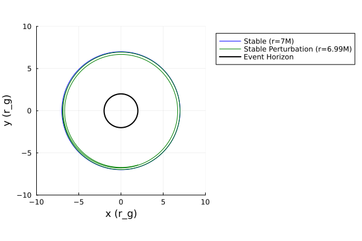
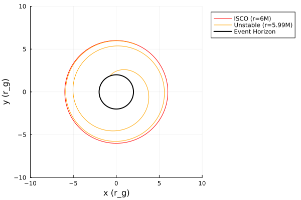
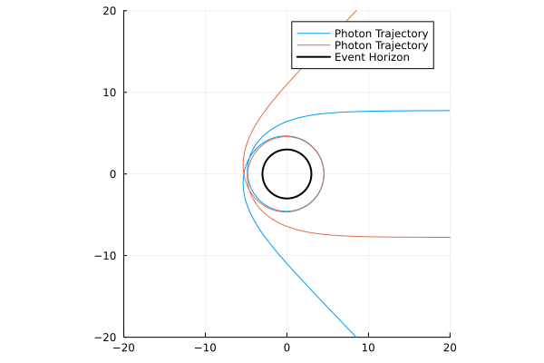

# Schwarzschild metric

The Schwarzschild metric describes the geometry of spacetime outside a non-rotating, spherical black hole with no magnetic field. Its only parameter is mass M.

## Metric definition

The metric is given by:
$$ds^{2} = -\left(1-\dfrac{r_s}{r}\right) dt^{2} + \left(1-\dfrac{r_s}{r}\right)^{-1}dr^{2} + r^{2}d\theta^{2} + r^{2}sin^{2}(\theta)d\phi^{2}$$

or in matrix form:

$$g_{\mu\nu} =
\begin{pmatrix}
-\left(1-\dfrac{r_s}{r}\right) & 0 & 0 & 0 \\
0 & \left(1-\dfrac{r_s}{r}\right)^{-1} & 0 & 0 \\
0 & 0 & r^2 & 0 \\
0 & 0 & 0 & r^2\sin^2\theta
\end{pmatrix}$$

where  

$$r_{s} = 2M$$
  
- ($t$) : time coordinate
- ($r$) : radial coordinate  
- ($\theta$) : polar angle  
- ($\phi$) : azimuthal angle  

## Christoffel symbols


$$\begin{aligned}
\Gamma^{r}_{tt} & = \frac{r_s (r - r_s)}{2 r^3}, & 
\Gamma^{t}_{tr} & = \frac{r_s}{2r(r - r_s)}, & 
\Gamma^{r}_{rr} & = -\frac{r_s}{2r(r - r_s)}, \\[2mm]
\Gamma^{\theta}_{r\theta} & = \frac{1}{r}, & 
\Gamma^{\phi}_{r\phi} & = \frac{1}{r}, & 
\Gamma^{r}_{\theta\theta} & = -(r - r_s), \\[2mm]
\Gamma^{\phi}_{\theta\phi} & = \cot\theta, & 
\Gamma^{r}_{\phi\phi} & = -(r - r_s)\sin^2\theta, & 
\Gamma^{\theta}_{\phi\phi} & = -\sin\theta \cos\theta
\end{aligned}$$


## Special radii

The ISCO of a Schwarzschild black hole is at $6r_s$ or $6M$. Matter inside this radius will spiral into the event horizon as shown here:


```@raw html
<details>
<summary>Click to expand / collapse code block.</summary>
```

```julia

using Gradus

# define Schwarzschild spacetime

struct Schwarzschild{T} <: AbstractStaticAxisSymmetric{T}
    M::T
end

function Gradus.metric_components(m::Schwarzschild, x)
    r, θ = x
    M = m.M

    dt2 = -(1 - (2M / r))
    dr2 = -inv(dt2)
    dθ2 = r^2
    dϕ2 = r^2 * sin(θ)^2
    dtdϕ = zero(r)

    SVector(dt2, dr2, dθ2, dϕ2, dtdϕ)
end

Gradus.inner_radius(m::Schwarzschild) = 2 * m.M

m = Schwarzschild(1.0)
x = SVector(0.0, 1000.0, π/2, 0.0)
v = SVector(0.0, -1.0, 0.0, -6.655e-6)

λ_max = 2000.0
sol = tracegeodesics(m, x, v, λ_max, μ=1.0)

using Plots

# plot solution trajectory
fig3 = plot_paths(sol, label = "Particle Trajectory", color = :red, n_points = 10000)
plot_horizon!(m, label = "Event Horizon", color = :black)

xlims!(-10, 10)
ylims!(-10, 10)
```
```@raw html
</details>
```


### Stable Orbit and Pertubation


The plot below shows two orbits. One is at $7M$ and one is pertubated slightly so appears at $6.99M$. Both of these orbits have equal velocity and both are circular. This shows that a slight pertubation to a stable orbit, (one that is outside the ISCO $(6M)$), will not cause it to spiral into the black hole.


```@raw html
<details>
<summary>Click to expand / collapse code block.</summary>
```

```julia
using Gradus, Plots

#Stable and Perturbed Stable orbits

# Schwarzschild black hole
m = KerrMetric(M=1.0, a=0.0)
λ_max = 20000

# Radii
r_stable = 7.0
r_stable2 = 6.99

# Initial velocities
v_stable   = CircularOrbits.fourvelocity(m, r_stable)  #gives the 4-velocity for a circular orbit at r_stable
v_stable2  = v_stable    # Perturbation: same velocity as stable orbit, but at a slightly smaller radius

# Initial positions
x_stable   = @SVector [0.0, r_stable, π/2, 0.0]
x_stable2  = @SVector [0.0, r_stable2, π/2, 0.0]

# Trace geodesics
sol_stable   = tracegeodesics(m, x_stable, v_stable, λ_max, μ=1.0)
sol_stable2  = tracegeodesics(m, x_stable2, v_stable2, λ_max, μ=1.0)


# Plot
p = plot(aspect_ratio=1)

plot_paths!(p, sol_stable,   label="Stable (r=7M)", color=:blue)
plot_paths!(p, sol_stable2,  label="Stable Perturbation (r=6.99M)", color=:green)
plot_horizon!(m, lw=2, color=:black, label="Event Horizon")

xlabel!("x")
ylabel!("y")


xlims!(-10, 10)
ylims!(-10, 10)  # Set limits to better visualize the orbits and horizon

plot!(p, legend=:outertopright)  # Adjust legend position to avoid overlap with trajectories

```
```@raw html
</details>
```




### Unstable Orbit and Pertubation


Whereas this figure shows two orbits again. Only this time one is on the ISCO and the other has a pertubation such that it is very slightly inside. Now, the one on the ISCO is only just stable and remains circular, but the pertubated one is in the plunging region so it spirals into the event horizon.

```@raw html
<details>
<summary>Click to expand / collapse code block.</summary>
```

```julia
using Gradus, Plots

#ISCO and unstable


# Schwarzschild black hole
m = KerrMetric(M=1.0, a=0.0)
λ_max = 2000

# Radii
r_ISCO   = 6.0
r_unstable = 5.99

# Circular geodesic velocities
v_ISCO     = CircularOrbits.fourvelocity(m, r_ISCO)
v_unstable = v_ISCO

# Initial positions
x_ISCO     = @SVector [0.0, r_ISCO, π/2, 0.0]
x_unstable = @SVector [0.0, r_unstable, π/2, 0.0]

# Trace geodesics
sol_ISCO     = tracegeodesics(m, x_ISCO, v_ISCO, λ_max, μ=1.0)
sol_unstable = tracegeodesics(m, x_unstable, v_unstable, λ_max, μ=1.0)

# Plotting
p = plot(aspect_ratio=1)

plot_paths!(p, sol_ISCO,     label="ISCO (r=6M)", color=:red)
plot_paths!(p, sol_unstable, label="Unstable (r=5.99M)", color=:orange)
plot_horizon!(m, lw=2, color=:black, label="Event Horizon")

xlims!(-10, 10)
ylims!(-10, 10)

plot!(p, legend=:outertopright)


xlabel!("x")
ylabel!("y")
```

```@raw html
</details>
```




### No Frame Dragging

As Schwarzschild black holes do not spin, the photon orbit and the ISCO will have a constant radius as there is no concept of prograde or retrograde motion. The figure below demonstrates this by showing two photon orbits going round the black hole, clockwise and anti-clockwise at the same radius.


```@raw html
<details>
<summary>Click to expand / collapse code block.</summary>
```

```julia
using Gradus, Plots

#Overlapping prograde and retrograde photon orbits around a Schwarzschild black hole


# Kerr black hole
m = KerrMetric(M=1.0, a=0.0)
λ_max = 2000

# Radii
r_pro   = 3.0
r_retro = 3.0

# Circular geodesic velocities
v_pro = @SVector [0.0, 0.0, 0.0, 1.1] #four velocities for circular orbits
v_retro = @SVector [0.0, 0.0, 0.0, -1.1]

# Initial positions
x_pro    = @SVector [0.0, r_pro, π/2, 0.0]    #starting at the same position
x_retro = @SVector [0.0, r_retro, π/2, 0.0]

# Trace geodesics
sol_pro = tracegeodesics(m, x_pro, v_pro, λ_max, μ=0.0)   #μ=0.0 is null geodesic (photon)
sol_retro = tracegeodesics(m, x_retro, v_retro, λ_max, μ=0.0)
# Plotting
p = plot(aspect_ratio=1)

plot_paths!(p, sol_retro, label="Clockwise orbit", color=:orange, n_points = 100000)
plot_paths!(p, sol_pro, label="Anti-clockwise orbit", color=:blue, n_points = 100000)
plot_horizon!(m, lw=2, color=:black, label="Event Horizon")

xlims!(-10, 10)
ylims!(-10, 10)


xlabel!("x")
ylabel!("y")
```
```@raw html
</details>
```



