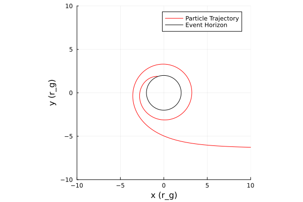
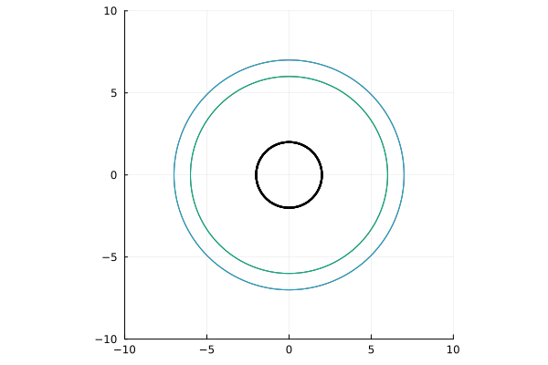

# Schwarzschild metric

The Schwarzschild metric describes the geometry of spacetime outside a non-rotating, spherical black hole with no magnetic field.

## Metric definition

The metric is given by:
$$ds^{2} = -\left(1-\dfrac{r_s}{r}\right) dt^{2} + \left(1-\dfrac{r_s}{r}\right)^{-1}dr^{2} + r^{2}d\theta^{2} + r^{2}sin^{2}(\theta)d\phi^{2}$$

or in matrix form:

$$g_{\mu\nu} =
\begin{pmatrix}
-\left(1-\dfrac{r_s}{r}\right) & 0 & 0 & 0 \\
0 & \left(1-\dfrac{r_s}{r}\right)^{-1} & 0 & 0 \\
0 & 0 & r^2 & 0 \\
0 & 0 & 0 & r^2\sin^2\theta
\end{pmatrix}$$

where  

$$r_{s} = 2M$$
  
- ($t$) : time coordinate
- ($r$) : radial coordinate  
- ($\theta$) : polar angle  
- ($\phi$) : azimuthal angle  

## Special radii

Around a Schwarzchild black hole is an area called the plunging region. In this region, all matter will spiral into the event horizon.

```julia

using Gradus

# define Schwarzschild spacetime

struct Schwarzschild{T} <: AbstractStaticAxisSymmetric{T}
    M::T
end

function Gradus.metric_components(m::Schwarzschild, x)
    r, θ = x
    M = m.M

    dt2 = -(1 - (2M / r))
    dr2 = -inv(dt2)
    dθ2 = r^2
    dϕ2 = r^2 * sin(θ)^2
    dtdϕ = zero(r)

    SVector(dt2, dr2, dθ2, dϕ2, dtdϕ)
end

Gradus.inner_radius(m::Schwarzschild) = 2 * m.M

m = Schwarzschild(1.0)
x = SVector(0.0, 1000.0, π/2, 0.0)
v = SVector(0.0, -1.0, 0.0, -6.655e-6)

λ_max = 2000.0
sol = tracegeodesics(m, x, v, λ_max, μ=1.0)

using Plots

# plot solution trajectory
fig3 = plot_paths(sol, label = "Particle Trajectory", color = :red)
plot_horizon!(m, label = "Event Horizon")
```




## Particle orbits

Outside the Innermost Stable Circular Orbit (ISCO) particles can follow circular orbits.

```julia
using Gradus, Plots

m = KerrMetric(M=1.0, a=0.0)

p = plot(aspect_ratio=1)

for r in [6.0, 7.0]
    v = CircularOrbits.fourvelocity(m, r)
    # trace the circular orbit
    path = tracegeodesics(m, @SVector([0.0, r, π/2, 0.0]), v, (0.0, 300.0), μ = 1.0)
    plot_paths!(p, path, extent = 10, legend = false)
    plot_horizon!(m, lw = 2.0, color = :black)
end
```


