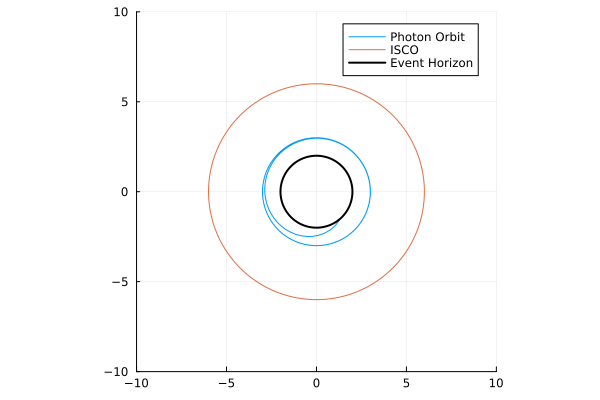
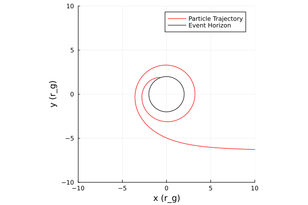
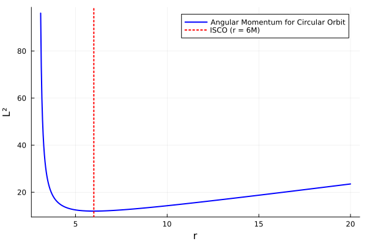
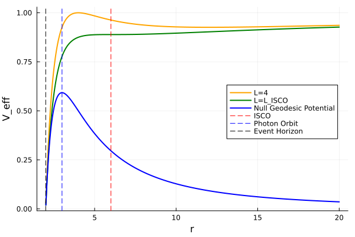
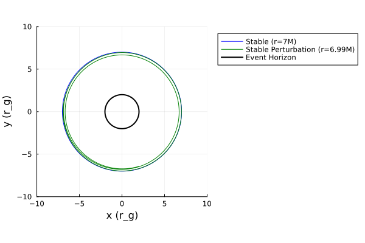
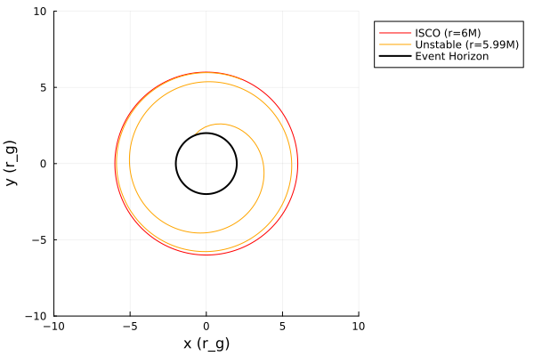
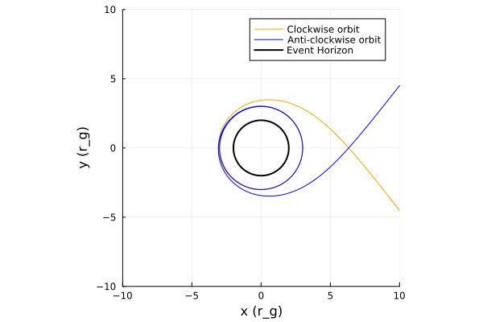

# Schwarzschild metric

The Schwarzschild metric describes the geometry of spacetime outside a non-rotating, spherical black hole with no magnetic field. Its only parameter is mass M.

## Metric definition

The metric is given by:
$$ds^{2} = -\left(1-\dfrac{r_s}{r}\right) dt^{2} + \left(1-\dfrac{r_s}{r}\right)^{-1}dr^{2} + r^{2}d\theta^{2} + r^{2}sin^{2}(\theta)d\phi^{2}$$

or in matrix form:

$$g_{\mu\nu} =
\begin{pmatrix}
-\left(1-\dfrac{r_s}{r}\right) & 0 & 0 & 0 \\
0 & \left(1-\dfrac{r_s}{r}\right)^{-1} & 0 & 0 \\
0 & 0 & r^2 & 0 \\
0 & 0 & 0 & r^2\sin^2\theta
\end{pmatrix}$$

where  

$$r_{s} = 2M$$
  
- ($t$) : time coordinate
- ($r$) : radial coordinate  
- ($\theta$) : polar angle  
- ($\phi$) : azimuthal angle  

## Christoffel symbols


$$\begin{aligned}
\Gamma^{r}_{tt} & = \frac{r_s (r - r_s)}{2 r^3}, & 
\Gamma^{t}_{tr} & = \frac{r_s}{2r(r - r_s)}, & 
\Gamma^{r}_{rr} & = -\frac{r_s}{2r(r - r_s)}, \\[2mm]
\Gamma^{\theta}_{r\theta} & = \frac{1}{r}, & 
\Gamma^{\phi}_{r\phi} & = \frac{1}{r}, & 
\Gamma^{r}_{\theta\theta} & = -(r - r_s), \\[2mm]
\Gamma^{\phi}_{\theta\phi} & = \cot\theta, & 
\Gamma^{r}_{\phi\phi} & = -(r - r_s)\sin^2\theta, & 
\Gamma^{\theta}_{\phi\phi} & = -\sin\theta \cos\theta
\end{aligned}$$


## Special radii

Around a Schwarzschild black hole, there are two key orbits with fixed radii. The event horizon has a radius of $2r_s$ or $2M$, the photon orbit is at 3M, and the ISCO is at 6M. These orbits are shown in the figure below.


```@raw html
<details>
<summary>Click to expand / collapse code block.</summary>
```

```julia

using Gradus, Plots

m = KerrMetric(M=1.0, a=0.0)

p = plot(aspect_ratio=1)

λ_max = 20000

# Radii
r_photon = 3
r_isco = 6

# Initial positions
x_photon = @SVector [0.0, r_photon, π/2, 0.0]
x_isco = @SVector [0.0, r_isco, π/2, 0.0]

# Circular geodesic velocities
v_photon = CircularOrbits.fourvelocity(m, r_photon)
v_isco = CircularOrbits.fourvelocity(m, r_isco)

path_ph = tracegeodesics(m, x_photon, v_photon, λ_max, μ = 0.0)
path_isco = tracegeodesics(m, x_isco, v_isco, λ_max, μ = 1.0)

# Plot
plot_paths!(p, path_ph, extent = 10, label="Photon Orbit")
plot_paths!(p, path_isco, extent = 10, label="ISCO")

plot_horizon!(m, lw=2, color=:black, label="Event Horizon")

p
```
```@raw html
</details>
```




The ISCO of a Schwarzschild black hole is at $6M$. Matter inside this radius will spiral into the event horizon as shown here:


```@raw html
<details>
<summary>Click to expand / collapse code block.</summary>
```

```julia

using Gradus

# define Schwarzschild spacetime

struct Schwarzschild{T} <: AbstractStaticAxisSymmetric{T}
    M::T
end

function Gradus.metric_components(m::Schwarzschild, x)
    r, θ = x
    M = m.M

    dt2 = -(1 - (2M / r))
    dr2 = -inv(dt2)
    dθ2 = r^2
    dϕ2 = r^2 * sin(θ)^2
    dtdϕ = zero(r)

    SVector(dt2, dr2, dθ2, dϕ2, dtdϕ)
end

Gradus.inner_radius(m::Schwarzschild) = 2 * m.M

m = Schwarzschild(1.0)
x = SVector(0.0, 1000.0, π/2, 0.0)
v = SVector(0.0, -1.0, 0.0, -6.655e-6)

λ_max = 2000.0
sol = tracegeodesics(m, x, v, λ_max, μ=1.0)

using Plots

# plot solution trajectory
fig3 = plot_paths(sol, label = "Particle Trajectory", color = :red, n_points = 10000)
plot_horizon!(m, label = "Event Horizon", color = :black)

xlims!(-10, 10)
ylims!(-10, 10)
```
```@raw html
</details>
```




### Effective Potential

The effective potential of a Schwarzschild black hole is given by:

$$V_{\rm eff}(r) = \left( 1 - \frac{2 M}{r} \right) \left( 1 + \frac{L^2}{r^2} \right)$$

By setting the derivative $\dfrac{dV_{\rm eff}}{dr} = 0$, we can see the condition for a circular orbit:

$$Mr^2 - L^2 r + 3ML^2 = 0$$

Rearranging this for $L^2$ gives us:

$$L^2 = \dfrac{Mr^2}{r-3M}$$

The figure below shows this equation plotted as a function of r. The denominator $r-3M$ means $L^2$ diverges when $r=3M$. The minimum of this function occurs at the ISCO radius $(r=6M)$.


```@raw html
<details>
<summary>Click to expand / collapse code block.</summary>
```

```julia
using Plots

M = 1.0

# Radius array (r > 3M to avoid divergence)
r = range(3.1*M, 20M, length=500)

# Angular momentum squared for circular orbits
L2 = M * r.^2 ./ (r .- 3*M)

# Plot L² vs r
plot(r, L2, xlabel="r", ylabel="L²", label ="Angular Momentum for Circular Orbit", lw=2, color=:blue)

# Add vertical dotted line for ISCO at r = 6M
vline!([6M], linestyle=:dot, lw=2, color=:red, label="ISCO (r = 6M)")
```
```@raw html
</details>
```




The value of the angular momentum at the ISCO can be determined by putting r=6M into the above equation for $L^2$ which gives $L_{\rm ISCO}=2\sqrt3M$. We can then plot the effective potential for different values of $L$ including $L_{\rm ISCO}$. The effective potential for a null geodesic is also shown which has a maximum at $3M$ (the photon orbit radius). The fact it is a maximum means it is an unstable orbit as expected.

The time-like geodesic $(L=4)$ has both a maximum $(r=4M)$ and a minimum $(r=12M)$. This means a particle moving with this angular momentum would form a stable orbit at $12M$ and could potentially form an unstable orbit at $4M$.

The ISCO potential line only has one stationary point and it is a point of inflection at $r=6M$. This shows that $L=2\sqrt3$ is the lower limit before a particle could not form a circular orbit anymore.


```@raw html
<details>
<summary>Click to expand / collapse code block.</summary>
```

```julia
using Plots

M = 1.0          # Black hole mass
L_val = 4.0      # Angular momentum of particle
L_ISCO = 2*sqrt(3) # Angular momentum at ISCO

# radius array (avoid r = 2M)
r = range(2.01*M, 20M, length=500)

# Schwarzschild effective potential
Veff = (1 .- 2*M ./ r) .* (1 .+ (L_val^2) ./ r.^2)
V_ISCO = (1 .- 2*M ./ r) .* (1 .+ (L_ISCO^2) ./ r.^2)
Vnull = (1 .- 2*M ./ r) .* ((L_val^2) ./ r.^2)


# plot
plot(r, Veff, xlabel="r", ylabel="V_eff", lw=2,
color=:orange, label="Timelike Geodesic Potential", legend=true)
plot!(r, V_ISCO, lw=2, color=:green, label="ISCO Potential")
plot!(r, Vnull, lw=2, color=:blue, label="Null Geodesic Potential")

# mark ISCO at r = 6M
L_ISCO = 2*sqrt(3)*M
Veff_ISCO = (1 - 2M/6M)*(1 + L_ISCO^2 / (6M)^2)
vline!([6M], linestyle=:dot, color=:red, label="ISCO")
vline!([3M], linestyle=:dash, color=:blue, label="Photon Orbit")
vline!([2M], linestyle=:dash, color=:black, label="Event Horizon")

plot!(legend=:right)
```
```@raw html
</details>
```




### Stable Orbit and Pertubation


The plot below shows two orbits. One is at $7M$ and one is pertubated slightly so appears at $6.99M$. Both of these orbits have equal velocity and both are circular. This shows that a slight pertubation to a stable orbit, (one that is outside the ISCO $(6M)$), will not cause it to spiral into the black hole.


```@raw html
<details>
<summary>Click to expand / collapse code block.</summary>
```

```julia
using Gradus, Plots

#Stable and Perturbed Stable orbits

# Schwarzschild black hole
m = KerrMetric(M=1.0, a=0.0)
λ_max = 20000

# Radii
r_stable = 7.0
r_stable2 = 6.99

# Initial velocities
v_stable   = CircularOrbits.fourvelocity(m, r_stable)  #gives the 4-velocity for a circular orbit at r_stable
v_stable2  = v_stable    # Perturbation: same velocity as stable orbit, but at a slightly smaller radius

# Initial positions
x_stable   = @SVector [0.0, r_stable, π/2, 0.0]
x_stable2  = @SVector [0.0, r_stable2, π/2, 0.0]

# Trace geodesics
sol_stable   = tracegeodesics(m, x_stable, v_stable, λ_max, μ=1.0)
sol_stable2  = tracegeodesics(m, x_stable2, v_stable2, λ_max, μ=1.0)


# Plot
p = plot(aspect_ratio=1)

plot_paths!(p, sol_stable,   label="Stable (r=7M)", color=:blue)
plot_paths!(p, sol_stable2,  label="Stable Perturbation (r=6.99M)", color=:green)
plot_horizon!(m, lw=2, color=:black, label="Event Horizon")

xlabel!("x")
ylabel!("y")


xlims!(-10, 10)
ylims!(-10, 10)  # Set limits to better visualize the orbits and horizon

plot!(p, legend=:outertopright)  # Adjust legend position to avoid overlap with trajectories

```
```@raw html
</details>
```




### Unstable Orbit and Pertubation


Whereas this figure shows two orbits again. Only this time one is on the ISCO and the other has a pertubation such that it is very slightly inside. Now, the one on the ISCO is only just stable and remains circular, but the pertubated one is in the plunging region so it spirals into the event horizon.

```@raw html
<details>
<summary>Click to expand / collapse code block.</summary>
```

```julia
using Gradus, Plots

#ISCO and unstable


# Schwarzschild black hole
m = KerrMetric(M=1.0, a=0.0)
λ_max = 2000

# Radii
r_ISCO   = 6.0
r_unstable = 5.99

# Circular geodesic velocities
v_ISCO     = CircularOrbits.fourvelocity(m, r_ISCO)
v_unstable = v_ISCO

# Initial positions
x_ISCO     = @SVector [0.0, r_ISCO, π/2, 0.0]
x_unstable = @SVector [0.0, r_unstable, π/2, 0.0]

# Trace geodesics
sol_ISCO     = tracegeodesics(m, x_ISCO, v_ISCO, λ_max, μ=1.0)
sol_unstable = tracegeodesics(m, x_unstable, v_unstable, λ_max, μ=1.0)

# Plotting
p = plot(aspect_ratio=1)

plot_paths!(p, sol_ISCO,     label="ISCO (r=6M)", color=:red)
plot_paths!(p, sol_unstable, label="Unstable (r=5.99M)", color=:orange)
plot_horizon!(m, lw=2, color=:black, label="Event Horizon")

xlims!(-10, 10)
ylims!(-10, 10)

plot!(p, legend=:outertopright)


xlabel!("x")
ylabel!("y")
```

```@raw html
</details>
```




### No Frame Dragging

As Schwarzschild black holes do not spin, the photon orbit and the ISCO will have a constant radius as there is no concept of prograde or retrograde motion. The figure below demonstrates this by showing two photon orbits going round the black hole, clockwise and anti-clockwise at the same radius.


```@raw html
<details>
<summary>Click to expand / collapse code block.</summary>
```

```julia
using Gradus, Plots

#Overlapping prograde and retrograde photon orbits around a Schwarzschild black hole


# Kerr black hole
m = KerrMetric(M=1.0, a=0.0)
λ_max = 2000

# Radii
r_pro   = 3.0
r_retro = 3.0

# Circular geodesic velocities
v_pro = @SVector [0.0, 0.0, 0.0, 1.1] #four velocities for circular orbits
v_retro = @SVector [0.0, 0.0, 0.0, -1.1]

# Initial positions
x_pro    = @SVector [0.0, r_pro, π/2, 0.0]    #starting at the same position
x_retro = @SVector [0.0, r_retro, π/2, 0.0]

# Trace geodesics
sol_pro = tracegeodesics(m, x_pro, v_pro, λ_max, μ=0.0)   #μ=0.0 is null geodesic (photon)
sol_retro = tracegeodesics(m, x_retro, v_retro, λ_max, μ=0.0)
# Plotting
p = plot(aspect_ratio=1)

plot_paths!(p, sol_retro, label="Clockwise orbit", color=:orange, n_points = 100000)
plot_paths!(p, sol_pro, label="Anti-clockwise orbit", color=:blue, n_points = 100000)
plot_horizon!(m, lw=2, color=:black, label="Event Horizon")

xlims!(-10, 10)
ylims!(-10, 10)


xlabel!("x")
ylabel!("y")
```
```@raw html
</details>
```



